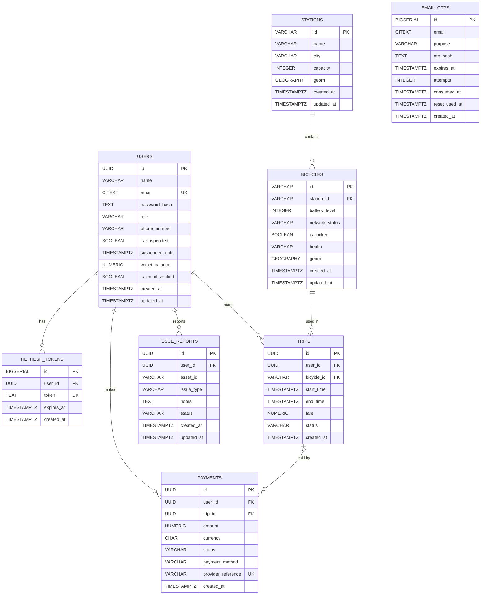

# VeloSync Entity Relationship Diagram (ERD)

This ERD is derived from `backend/database/schema.sql` on the `main` branch.

## Relationship notes

- `refresh_tokens.user_id` → `users.id` with `ON DELETE CASCADE`.
- `bicycles.station_id` → `stations.id` with `ON DELETE SET NULL`.
- `trips.user_id` → `users.id` with `ON DELETE RESTRICT`.
- `trips.bicycle_id` → `bicycles.id` with `ON DELETE RESTRICT`.
- `payments.user_id` → `users.id` with `ON DELETE RESTRICT`.
- `payments.trip_id` → `trips.id` with `ON DELETE SET NULL`.
- `issue_reports.user_id` → `users.id` with `ON DELETE SET NULL`.
- `email_otps.email` is not defined as a foreign key to `users.email`; OTP records are therefore shown as an independent entity.
- `issue_reports.asset_id` is not defined as a foreign key to `bicycles.id`; it is shown as an ordinary attribute.

## Important constraints represented by the schema

- A user wallet balance cannot be negative.
- Payment `amount` must be greater than `0`, so zero-rupee transactions are rejected at the database level.
- Only one active (`IN_PROGRESS`) trip can exist per bicycle.
- Bicycle battery level is restricted to 0–100.
- Bicycle network status is `ONLINE`, `OFFLINE`, or `UNKNOWN`.
- Trip status is `IN_PROGRESS`, `COMPLETED`, or `CANCELLED`.
- Payment status is `PENDING`, `SUCCEEDED`, `FAILED`, or `DEMO`.
- PostGIS geography fields support station and bicycle location data.
